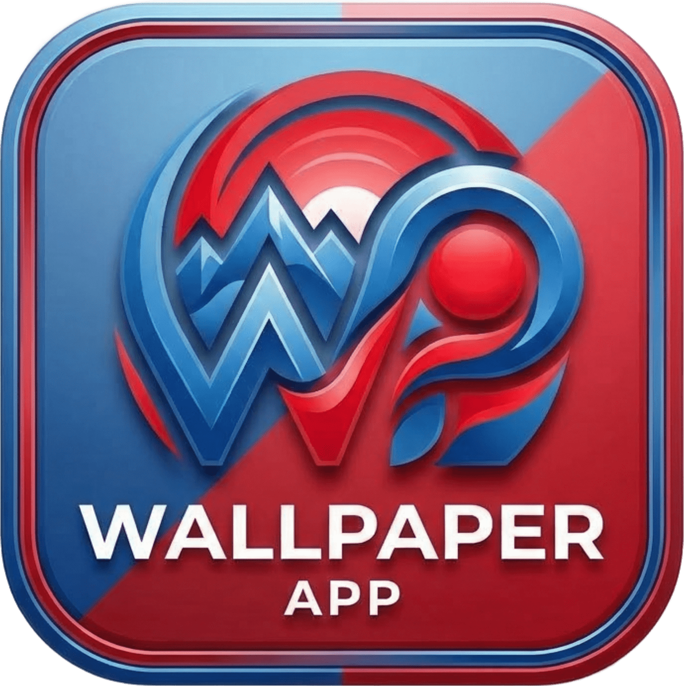
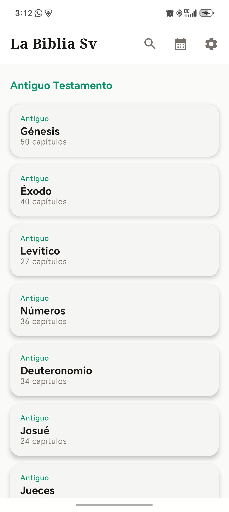
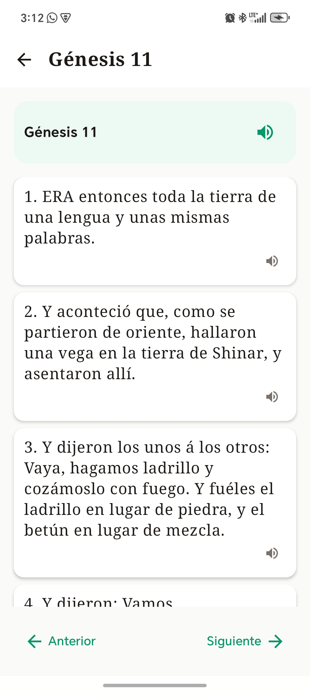
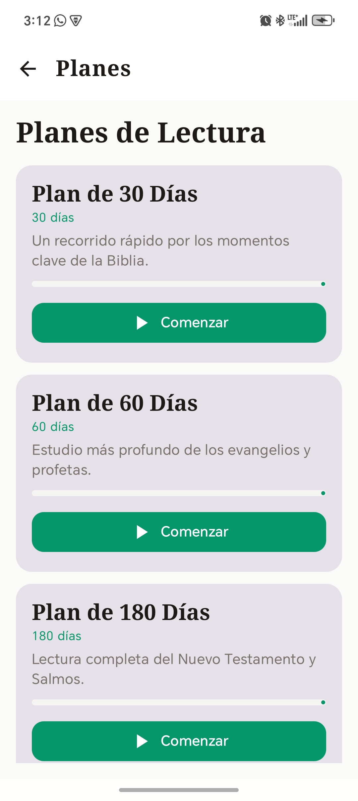
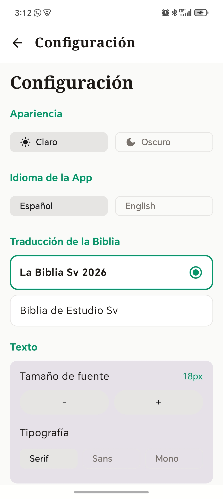
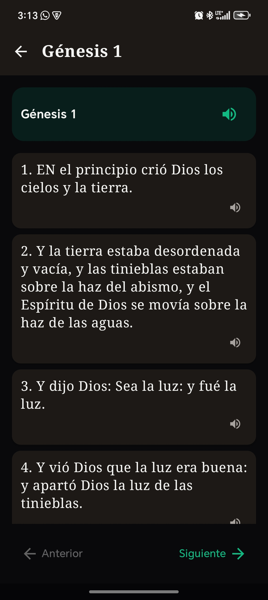
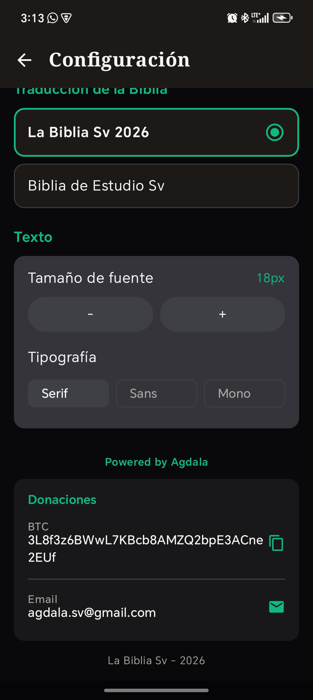

<div align="center">
  
  <h1>La Biblia SV</h1>
  <p>Aplicación móvil y web para leer la Biblia</p>
</div>

## Características

- 📖 Múltiples traducciones (RVR, King James, Study Bible)
- 🌐 Español e Inglés
- 🔍 Búsqueda de versículos
- 📅 Planes de lectura
- 🔊 Text-to-Speech
- ⭐ Favoritos, notas y resaltado
- 🌙 Modo oscuro

## Capturas de pantalla

<div align="center">
  
  
  
</div>
<div align="center">
  
  
  
</div>

## Descargar

### Android
[Descargar APK v2.0](https://github.com/agdalasv/labibliasv/releases/latest/download/app-release.apk)

### Web
[La Biblia SV Web](https://agdalasv.github.io/labibliasv)

## Desarrollador

Desarrollado por agdala.sv@gmail.com

## Invita un café ☕

Si te gusta este proyecto, puedes invitarme un café:

```
BTC: 3L8f3v6BWwL7KBcb8AMZQ2bpE3ACne2EUf
```

<div align="center">
  
</div>
